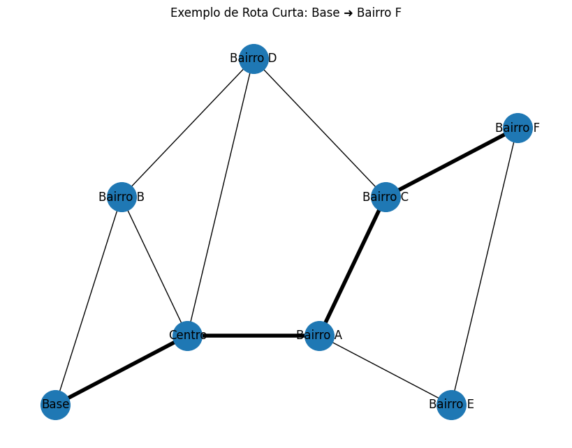
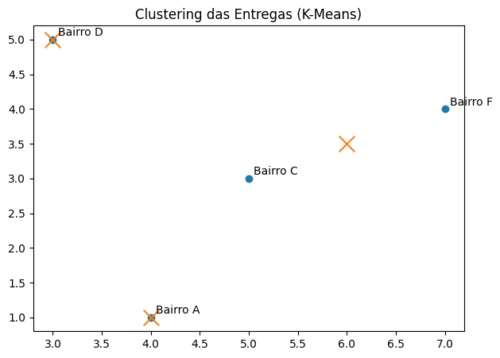

# Rota Inteligente: Otimização de Entregas com IA (Sabor Express)

## Visão Geral
Este projeto resolve o desafio de uma empresa local de delivery (“**Sabor Express**”) que sofre com rotas ineficientes em horários de pico.  
A solução usa **algoritmos clássicos de Inteligência Artificial (IA)** para otimizar o tempo e reduzir o custo das entregas.

### Objetivos
- **Encontrar as melhores rotas** entre bairros usando grafos e algoritmos de busca (Dijkstra e A*).  
- **Agrupar entregas próximas** usando o algoritmo de **K-Means**.  
- **Gerar uma rota otimizada por entregador** usando uma **heurística gulosa**.  

Com isso, buscamos melhorar a eficiência operacional e a satisfação dos clientes.

---

## Como Executar o Projeto

1️⃣ Abra o **[Google Colab](https://colab.research.google.com)**  
2️⃣ Faça upload da pasta `data/` contendo os arquivos:
   - `nodes.csv`
   - `edges.csv`
   - `deliveries.csv`
3️⃣ Faça upload do arquivo `Rota_Inteligente.ipynb` (este notebook).  
4️⃣ Execute todas as células na ordem (menu: **Runtime → Run all**).  

> 🔧 Dependências necessárias (já vêm instaladas no Colab):  
> `networkx`, `scikit-learn`, `matplotlib`

---

## Estrutura do Repositório

/sabor-express-ai
```
├── README.md
├── Rota_Inteligente.ipynb
├── /data
│ ├── nodes.csv
│ ├── edges.csv
│ └── deliveries.csv
└── /images
├── grafo_cidade.png
├── rota.png
└── clustering_entregas.png
```

---

## Modelagem do Problema

A cidade é representada como um **grafo ponderado**, em que:

- **Nós (V)** representam bairros ou pontos de entrega.  
- **Arestas (E)** representam ruas, com **peso (weight)** baseado em distância ou tempo estimado.  
- **Entregas** estão associadas a nós específicos (locais onde há pedidos).  

O algoritmo deve encontrar as **rotas mais curtas** entre múltiplos pontos e propor **agrupamentos inteligentes**.


### 🗺️ Diagrama do Grafo da Cidade

A imagem abaixo mostra o **grafo da cidade** modelado pelo código,  
com os **bairros representando os nós** e as **ruas representando as arestas** usadas nos cálculos do Dijkstra e A*.


---

## Algoritmos Utilizados

### 🔹 Dijkstra
Usado para encontrar o caminho mais curto entre dois nós, considerando pesos positivos (distâncias ou tempos).

### 🔹 A* (A-Estrela)
Semelhante ao Dijkstra, mas utiliza uma **heurística euclidiana** (distância direta) para acelerar a busca.

### 🔹 K-Means (Clustering)
Agrupa os pontos de entrega em **zonas geográficas próximas**, permitindo distribuir entregas entre diferentes entregadores.

### 🔹 Heurística Gulosa
Define a ordem de visita dentro de cada cluster: sempre ir para o **ponto mais próximo** a partir da posição atual.


### 🚚 Exemplo de Rota Otimizada

A imagem abaixo mostra um exemplo de **rota gerada pelo algoritmo de Dijkstra**,  
representando o **trajeto mais curto** entre os pontos de entrega definidos.  



---

## Métricas e Resultados

O projeto exibe:
- **Caminhos mínimos** calculados por Dijkstra e A*.  
- **Agrupamento visual** das entregas (K-Means).  
- **Rotas otimizadas por cluster** e **distância total estimada**.  
- **Comparação com um baseline** (ordem ingênua das entregas).

Essas análises permitem observar a **redução da distância total percorrida**, indicando **melhor eficiência**.


### 📊 Agrupamento de Entregas com K-Means

A figura abaixo mostra o **resultado do agrupamento das entregas** usando o algoritmo **K-Means**.  
Cada cor representa uma **zona de entregas** diferente, o que permite dividir melhor o trabalho entre os entregadores.



---

## Limitações e Melhorias Futuras

🔸 A heurística gulosa não garante o caminho globalmente ótimo (não resolve o problema TSP completo).  
🔸 O sistema usa distâncias fixas — não considera **tráfego em tempo real**.  
🔸 O valor de **k (número de clusters)** é fixo, mas pode ser ajustado dinamicamente.  

**Possíveis melhorias:**
- Usar o **método do cotovelo** para escolher k automaticamente.  
- Adicionar **janelas de tempo** (Time Windows) e **capacidade de veículos**.  
- Integrar dados de **tráfego dinâmico (tempo real)**.  
- Aplicar **metaheurísticas** (Ex: Algoritmos Genéticos, Simulated Annealing).  

---

## Referências
- Estudo de caso da UPS – ORION (heurísticas e tráfego em tempo real).  
- “Optimizing Logistics: Clustering e MILP” – Medium.  
- “AI-Powered Route Optimization” – ResearchGate.  
- Kardinal.ai – *Case Study: Fresh Product Delivery*.  

---

## Autoria
Projeto acadêmico desenvolvido para a disciplina **Artificial Intelligence Fundamentals**.  
Autora: *Gisele Santos*  
Ano: 2025
